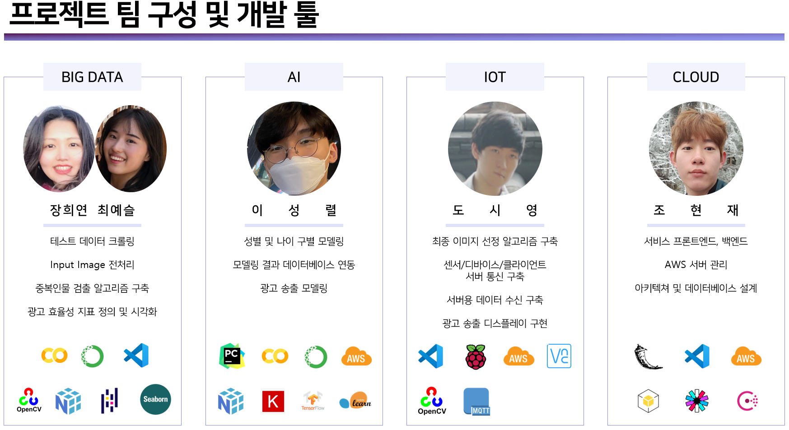
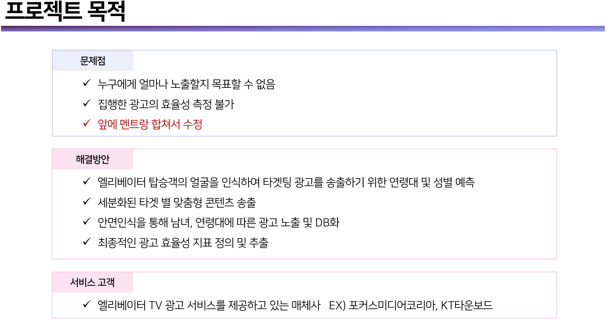
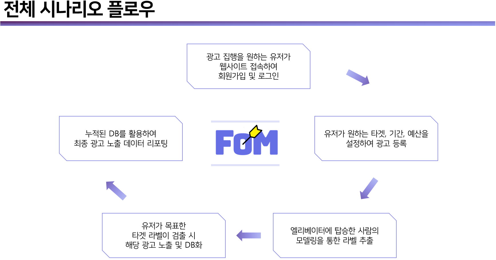
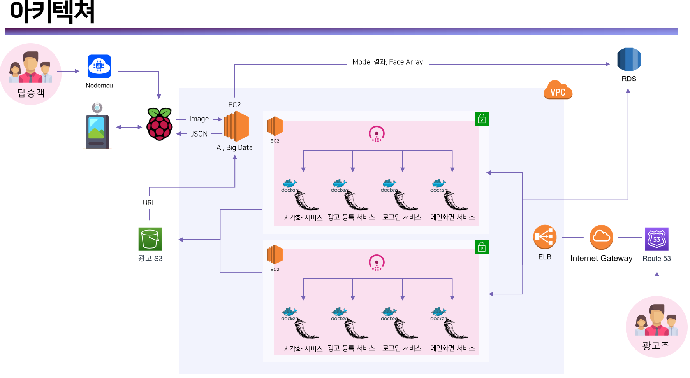

# Cloud

전체 프로젝트에서 클라우드 가 맡은 부분중에 하나인 웹부분의 Front-end, Back-end 부분입니다.

마이크로서비스 형식으로 로그인, 광고등록, 메인서버, 데이터베이스를 활용한 시각화 서버 4개를 활용하여 제작하였습니다.

서버간 IP 통신을 Consul을 사용하여 제작하였고 JWT Access Token을 사용하여 로그인, 로그아웃 기능과 페이지 권한, 역할 들을 설정하였습니다.

도메인[http://focuson-me.site]을 구입하여 서비스 완성을 하였고 전체적인 완성부분은 밑에 영상파일과 PPT파일을 통해 보여드리도록 하겠습니다.

▶ Tool

- Language : Python
- IDE : VScode
- Library : boto3 / JWT / Consul / Pymysql / Restful API
- Web Tool : HTML / CSS / JS
- Web Framework : Flask

## Collaborators

- Bigdata : [장희연](https://github.com/hiiiiyeon), [최예슬](https://github.com/yschoi9930)
- AI : [이성렬](https://github.com/leesungryul)
- IoT : [도시영](https://github.com/dsy-sw)

### PPT File

-  [Focus on Me 포트폴리오.pptx](README.assets/Focus on Me 포트폴리오.pptx) 

# 배경

# Architecture

